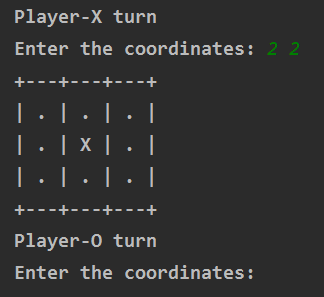

# Tic-Tac-Toe

  Tic-tac-toe is a game for two players, X and O, who take turns marking the spaces in a 3×3 grid. The player who succeeds in placing three   of their marks in a horizontal, vertical, or diagonal row is the winner.

---

## How to install

To start with you have to download this project. You can do it with the command below:

```git clone https://github.com/SkyLexxX/Tic-Tac-Toe.git```

Then you have to download the required library tabulate with the command:

```pip install tabulate```

Now you are ready to use this project. To launch it just run main.py

## How to play

As long as it is a console application all activities will be in our console. The player-X starts first and it needs to enter the coordinates of his mark. Then it is the turn of the next player



If three marks are placed in a horizontal, vertical, or diagonal row the game will over.
